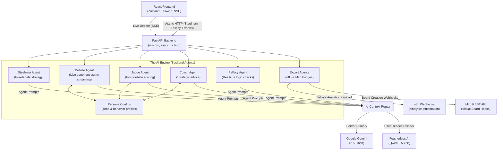

# P·A·R·I·T·Y ⚖️
**Parallel Algorithms for Resolution of Ideological and Tactical Yields**

Welcome to **Parity**, a next-generation Debate Intelligence Engine built for **LovHack Season 2**. It is an interactive platform where users engage in live, AI-powered debates against distinct AI personas, receiving real-time logic analysis, fallacy detection, coaching hints, and a final scored verdict.

**Live Demo**: [https://parity-590758428196.us-central1.run.app](https://parity-590758428196.us-central1.run.app)

---

## 🏗️ System Architecture & Data Flow

Parity uses a modular, multi-agent AI framework decoupled from the API layer. The backend dynamically routes requests to different Large Language Models depending on task latency requirements and user configuration.

### Architecture Diagram



### Deep Dive: How the Architecture Works
1. **The AI Context Router (`client.py`)**: Parity uses a dynamic provider router. When a user provides their own Featherless key via the UI (stored only locally in the browser), the frontend passes it via the `X-Featherless-Key` header. The middleware injects this into Python `ContextVars` (thread-safe for async), causing all agents for that specific HTTP request to transparently route their generation to Featherless AI (Qwen). Otherwise, the server defaults to Google Gemini 2.5 Flash.
2. **Server-Sent Events (SSE)**: Standard HTTP polling is too slow for conversational AI. Parity uses Python Async Generators (`stream_debate_response`) connected to FastAPI's `StreamingResponse`, enabling the React frontend to parse and render the AI's response markdown chunks natively with sub-100ms latency.
3. **Decoupled Single-Container Hosting**: The frontend and backend run natively on Google Cloud Run out of a multi-stage Dockerfile. Stage 1 bundles the React app, and Stage 2 runs Uvicorn, which serves the API *and* seamlessly falls back to serving static frontend files using `StaticFiles`, requiring only one server deployment.

---

## 🌟 Comprehensive Feature Set

### 1. The Steelman Engine
Before entering a debate, the system queries the **Steelman Agent**. This agent analyzes the user's topic and proactively generates the strongest, most charitable arguments exclusively for *both sides*. By enforcing charitable interpretation ("steelmanning") rather than tearing down arguments ("strawmanning"), the engine primes the session for a high-quality ideological clash.

### 2. Live AI Personas
User arguments are pitched against specialized AI agent profiles injected into the context window:
- **Socrates**: Probing, philosophical, questions assumptions via the Socratic method.
- **Machiavelli**: Pragmatic, ruthless, focuses strictly on systemic outcomes and power dynamics.
- **The Scientist**: Empirical, demands data, strictly rational.
- **The Troll**: Provocative, utilizes aggressive rhetoric (fun/casual mode).
- **The Diplomat**: Balanced, constantly seeks middle-ground synthesis.

### 3. The Live "Coach & Fallacy" Layer
During the debate, the frontend fires asynchronous requests simultaneously with the debate stream:
- **The Fallacy Agent**: An ultra-fast, secondary LLM call evaluates the active text to flag logic violations (Ad Hominem, Strawman, Red Herring, etc.).
- **The Coach Agent**: Acts as the user's corner-man. Takes the opponent's incoming argument and generates a hidden strategy hint on how to dismantle its core premise.

### 4. The Impartial AI Judge
At the end of the round limit, the full debate transit history is packaged and sent to the **Judge Agent**. The Judge ignores the persona rules and grades the user and the AI on *Clarity*, *Logic*, and *Evidence*, outputting a definitive winner, final scores, and a detailed verdict highlighting the best arguments made by either side.

---

## 🔌 Sponsor Integrations (LovHack S2)

### 🪶 Featherless AI (Core Inference)
Featherless AI powers the open-weights intelligence behind the platform. Users can bypass server limits instantly by providing their own `FEATHERLESS_API_KEY` in the UI to unlock continuous chat directly with the powerful `Qwen2.5-72B-Instruct` model.

### 🗺️ Miro API
Debate outcomes are ephemeral unless mapped. Users can click "Export to Miro", which triggers the `miro_agent.py`. The agent interfaces with the Miro REST API to programmatically generate a canvas featuring the Topic framed at the top, columns branching into the FOR and AGAINST arguments, and the final judicial verdict and scores mapped sequentially on visual sticky notes and cards.

### 🔄 n8n Webhooks
For users who want continuous tracking, pressing "Send to n8n" packages a massive JSON analytics payload containing the topic, the transcript size, the scores, the best arguments, and the verdict. This hits an n8n webhook, which you can configure to automatically email debate transcripts, log metrics to Google Sheets, or post the hall of fame updates to Discord.

---

## 🚀 Local Development Setup

### 1. Environment variables
Create a `.env` file in the project root:
```env
FEATHERLESS_API_KEY=your_featherless_api_key
GOOGLE_API_KEY=your_gemini_api_key (used as the server's primary)
N8N_WEBHOOK_URL=http://localhost:5678/webhook/parity-debate (optional webhook)
MIRO_ACCESS_TOKEN=your_miro_token (optional)
```

### 2. Start the Application
Run the React Frontend:
```bash
npm install
npm run dev
# Vite runs on http://localhost:5173
```

Run the FastAPI Backend:
```bash
# It is recommended to use virtual environments (.venv)
pip install -r requirements.txt
uvicorn main:app --reload --host 0.0.0.0 --port 8000
# FastAPI runs on http://localhost:8000
```
*(The React Vite proxy configuration will automatically map client-side `/api/` calls directly to the 8000 port during development.)*

---

## ☁️ Google Cloud Run Deployment

Deployment is fully automated via the multi-stage Docker build pipeline, ensuring you don't have to compile your frontend manually.

```bash
# Setup your Google Cloud Project
gcloud config set project your-project-id

# Push the Docker container via Cloud Build and map to port 8080
gcloud run deploy parity \
  --source . \
  --region us-central1 \
  --allow-unauthenticated \
  --clear-base-image \
  --set-env-vars="FEATHERLESS_API_KEY=...,GOOGLE_API_KEY=..."
```

---
*Developed for LovHack Season 2*
